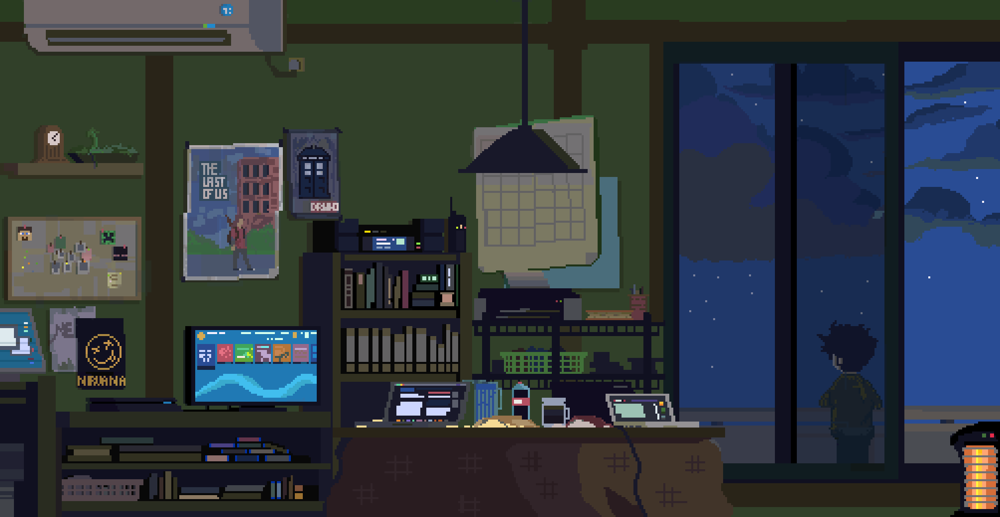

<h1 align="center">👋 Hi, I'm Prakash Mane</h1>  

(my <a href="https://drive.google.com/drive/folders/1OglDrlnuIiFicdSWU3YQK2DZNegZ8bK_?usp=drive_link">resume 😬</a>)
  

  

---
<h3 align="center">🚀 Full-Stack Developer | MERN | Java | SQL/NoSQL | Freelancer</h3>  

---

  🌱 Currently learning advanced DSA & backend frameworks  
  💼 Freelance experience: built secure login/admin dashboard features for clients  
  🔭 Exploring cloud technologies like AWS  
  ⚡ Fun fact: I enjoy solving coding challenges & building side projects  

---

# ⚡ Tech Stack  

### 💻 Languages  

  
  
  
  
  
  
  
  

  

### ⚙️ Frameworks / Libraries / Technologies  

  
  
  
  
  
  
  
  
  
  
  
  
  
  

  

### 🛠️ Tools  

  
  
  
  
  
  
  
  
  

  

---

## 🧩 Competitive Programming Stats (Beginner ik 😅)

| LeetCode | Codeforces |
|----------|------------|
|  |  |

---

## 🔗 Connect with me  

  
  
  
  
  
  
  

---

⭐️ From [PRM710](https://github.com/PRM710)
